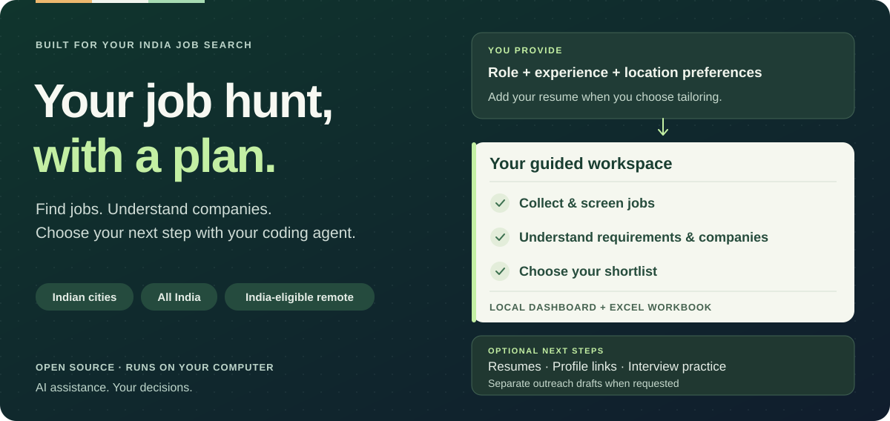
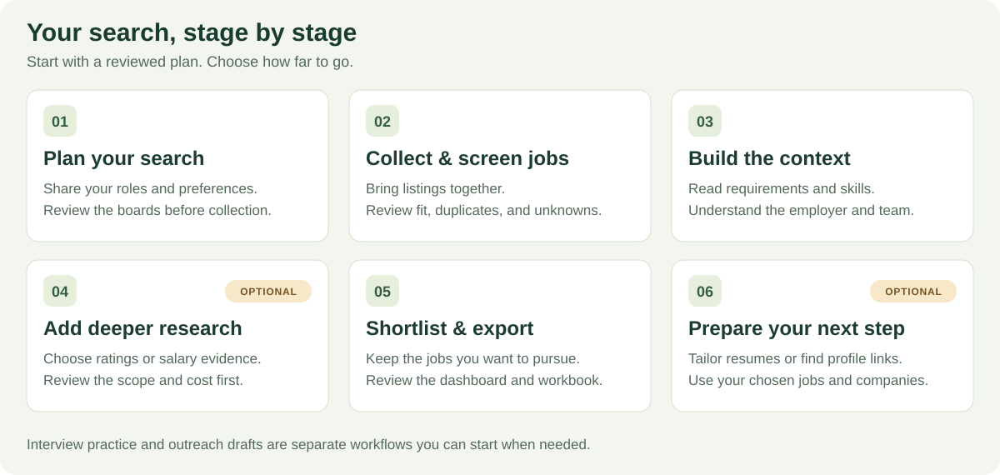

<h1 align="center">Job Atlas</h1>
<p align="center"><strong>Your AI-assisted job hunt, built for India.</strong></p>
<p align="center">Find opportunities. Understand the companies. Prepare your next move.</p>

<p align="center">
  <a href="#get-started">Get started</a> ·
  <a href="#your-job-hunt-in-one-place">What it does</a> ·
  <a href="#built-around-your-search">Make it yours</a> ·
  <a href="#where-it-searches">Job boards</a> ·
  <a href="docs/technical-guide.md">Documentation</a>
</p>



<p align="center">
  <a href="LICENSE"></a>
  
  
  
</p>

Searching for a job can become a job of its own: repeat the same searches across boards, open dozens of tabs, spot duplicates, research employers, and rewrite your resume for each opportunity.

**Job Atlas brings that work into one guided workspace.** Tell it what you want, review the search plan, and let your coding agent coordinate collection, screening, company research, shortlisting, and optional resume preparation. Keep the results in a local dashboard and export a workbook you can use outside the project.

Built from an India-specific job hunt, it includes boards such as **Naukri, Foundit, Instahyre, IIMJobs, Shine, and TimesJobs**, alongside LinkedIn and remote-job sources. You choose the profession, experience range, cities, and work arrangements.

## Your job hunt, in one place



| Component | What it does for you | What you get |
|---|---|---|
| **🔎 Job discovery** | Searches your selected boards and brings listings together, removing duplicates. | One place to review opportunities, with original job links. |
| **🎯 Fit screening** | Checks your role, experience, job type, and location preferences; flags missing evidence. | Kept, rejected, and reviewable results with reasons. |
| **🏢 Company research** | Builds employer context; optional deeper research adds available ratings, work-life-balance, and India salary evidence. | More context for deciding where to spend your time. |
| **📋 Shortlist & dashboard** | Lets you explore results and select all eligible jobs, a manual shortlist, or filtered matches. | A shortlist you control, with a dashboard for browsing. |
| **📄 Resume tailoring** | Adapts your private resume to selected jobs using your actual experience. | Job-specific resumes and an honest match report. |
| **🔗 People & exports** | Optionally finds relevant LinkedIn profile links and exports the selected results. | A local Excel workbook, source links, and resume artifacts. |

**Keep preparing after the search.** Use `mock-interview` for adaptive interview practice around a role, job description, resume, or project. Separately, `draft-outreach` can help discover contacts and prepare Gmail drafts when you explicitly request it. These are optional companion workflows; outreach never sends messages automatically.

## Built around your search

Start with what you want in ordinary language:

> I'm a digital marketing specialist with three years of experience. Find onsite or hybrid jobs in Pune and Mumbai, plus remote roles open to people in India. Show me which boards you can search before starting. Help me compare the companies, shortlist suitable roles, and tailor my resume to the jobs I choose.

You can shape the search around:

| Your preference | Examples |
|---|---|
| **Role** | Marketing, finance, operations, software, data, or another profession. |
| **Experience & job type** | A specific experience range. Internships and part-time jobs are excluded unless you explicitly include them. |
| **Location** | One Indian city, several cities, anywhere in India, or India-eligible remote work. |
| **Work arrangement** | Onsite, hybrid, remote, or a combination. |
| **Search period** | The last 14 days by default, or any requested period from 1 to 30 days. If a source still returns an older job, it remains eligible and shows its actual age. |
| **Job boards** | Named sources, a requested number, or all compatible sources. |
| **How far to go** | Review jobs first, then choose company research, tailoring, and profile discovery as needed. |

The agent turns your request into a plan for you to review. Coverage depends on the board and role; the preview shows incompatible sources and setup requirements. These examples illustrate configuration, not a guarantee of results for every profession or level.

[See city, India-wide, and remote configuration examples →](docs/technical-guide.md#choose-a-city-anywhere-in-india-or-remote)

## Where it searches

**19 integrated sources**, with the exact selection based on your preferences and each board's capabilities.

| India-focused boards | Broader & specialist boards | Remote-job sources |
|---|---|---|
| Naukri | LinkedIn | Himalayas |
| Foundit | Indeed | We Work Remotely |
| Instahyre | Glassdoor | Working Nomads |
| IIMJobs | Wellfound | Hacker News Hiring |
| Cutshort | Built In | |
| Shine | eFinancialCareers | |
| TimesJobs | Talent.com | |
| ZipRecruiter India | | |

Global sources are screened for India eligibility. Some sources need a saved session or a browser; **Indeed requires an attended desktop session**. Review source status alongside the results: access can be blocked, and a board may be unable to resolve a requested city.

[Source requirements and coverage →](docs/technical-guide.md#active-sources)

## Get started

**For job seekers comfortable working with a coding agent.** You'll need Python 3.11+ and an agent environment that supports local skills. The project supports Windows, macOS, and Linux.

**1. Install and set up Job Atlas.** The recommended installation keeps the tool isolated and does not require cloning this repository:

```bash
uv tool install job-atlas
job-atlas setup
```

`setup` creates private local SQLite storage and installs the seven job-seeker skills into `~/.agents/skills`. Restart your coding agent once so it discovers them, then launch the visual workspace at any time with `job-atlas-dashboard`. Optional alternatives are `pipx install job-atlas` and `pip install job-atlas`. While the package remains in beta, maintainers can use `pip install .` from a checkout. Follow the [setup guide](docs/technical-guide.md#quick-start) for browser and optional provider setup.

**2. Describe your search.** Invoke the skill with your preferences:

```text
$full-pipeline
Find digital marketing jobs in Pune or Mumbai, plus India-eligible remote
roles, for someone with three years of experience. Show me the plan first.
```

If the shortcut is missing, run `job-atlas skills status`, reinstall with `job-atlas skills install`, and restart the agent. See the [skills catalog](docs/skills.md) for the optional preparation, research, and maintainer workflows.

**3. Review, then let it work.** Confirm the proposed sources and search preferences. The exported workbook starts every shortlisted job as **Approved** and gives you an **Approved/Declined** dropdown. Return the saved workbook to your coding agent to create the exact job set for optional resume tailoring and LinkedIn profile research. Add your own [private resume master](examples/resume-master.example.yaml) when you want tailored resumes.

Want to browse the results visually? Open the [local dashboard](docs/technical-guide.md#dashboard). Prefer configuration files or direct commands? Use the [technical guide](docs/technical-guide.md).

## Your search, your decisions

- **A private local workspace.** Profiles, results, and resume data live outside the repository by default. Selected job boards, your coding-agent service, and optional research providers still process the requests sent to them.
- **Reviewable AI assistance.** Inspect the plan, evidence, and shortlist. Missing salary, location, or company information stays visible as an unknown.
- **Truthful resumes.** Tailoring uses your resume master; missing qualifications remain gaps in the match report.
- **Optional spending.** Your coding-agent service may have its own costs. Deeper company research and profile discovery can require paid provider access, with a reviewed scope and spending limit.
- **Resume interrupted work.** Completed collection and stored evidence can be reused, so you can continue an unfinished search.

The guided workflow covers discovery through preparation and export. You review applications and submit them yourself. It does not auto-apply or send outreach.

## Beta, with clear boundaries

Source access and inventory can change. Some boards return promoted or broad matches; uncertain eligibility needs review. Not every company has salary or work-life-balance evidence, and a remote listing does not necessarily accept applicants in India. Respect each board's terms and access controls.

[Current limitations](docs/technical-guide.md#current-limitations) · [Responsible use](docs/technical-guide.md#safety-and-responsible-use)

---

**Help make job hunting in India less repetitive.** Found a broken source or confusing step? Open an issue with the board name and a reproducible example, keeping resumes and credentials private. Contributors can start with [architecture](docs/technical-guide.md#architecture), [testing](docs/technical-guide.md#testing), or [adding a source](docs/technical-guide.md#adding-a-source).

[MIT licensed](LICENSE) · [Technical guide](docs/technical-guide.md) · [Skills catalog](docs/skills.md) · [Design decisions](docs/adr/)
